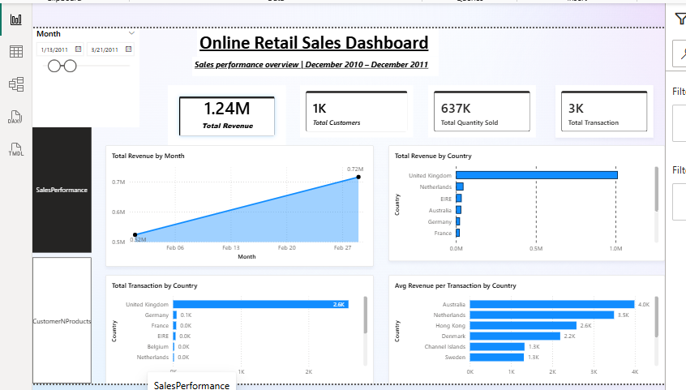
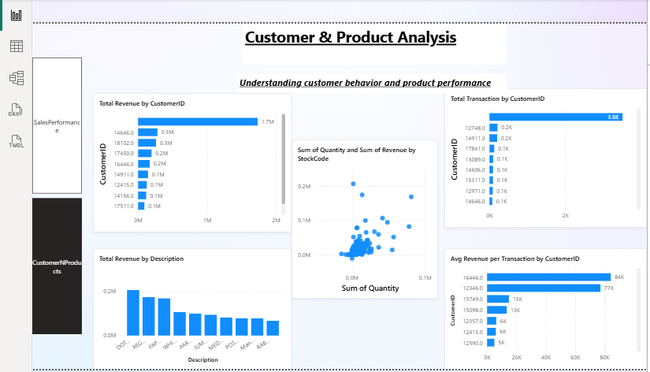

# Online Retail Data Analysis

## Project Overview

This project analyzes an online retail dataset from raw data through cleaning, exploratory data analysis (EDA), SQL analysis, and Power BI visualization.

## Tools Used

- Excel
- Python (Pandas)
- MySQL
- Power BI
- Git & GitHub

- ## Project Goals

- Clean and prepare the raw retail data for analysis
- Explore sales, products, customers, and countries
- Analyze the data using SQL
- Identify useful patterns and trends
- Build an interactive Power BI dashboard
- Present the findings in a clear and understandable way.

- ## Dataset

The dataset contains transactional records from an online retail business.

### Dataset Details

- **Rows:** 541,909
- **Columns:** 8
- **Time Period:** December 2010 – December 2011
- **Countries:** Multiple countries, with the majority of transactions from the United Kingdom
- **Main identifiers:** InvoiceNo, StockCode, CustomerID
- **Main measures:** Quantity and UnitPrice

- ## Data Cleaning & Preparation

The raw dataset was inspected and cleaned before analysis.

The cleaning process :

- Checking the dataset structure and data types
- Identifying missing values
- Identifying duplicate records
- Investigating negative quantities and prices
- Removing duplicate records
- Creating calculated fields needed for analysis
- Preparing the cleaned dataset for further analysis

- ## EDA

Exploratory Data Analysis was performed to understand the structure, patterns, and characteristics of the retail data.

The analysis explored:

- Sales transactions and invoice activity
- Product quantities and prices
- Revenue generated from transactions
- Customer activity
- Sales across different countries
- Monthly and yearly sales patterns
- Frequently purchased products
- Unusual or potentially problematic records

The analysis helped identify patterns and questions that were explored further through SQL and Power BI.

## SQL Analysis

The cleaned retail data was imported into MySQL for further analysis.

SQL was used to:

- Query and filter transactional data
- Analyze sales by country
- Examine customer and invoice activity
- Identify product level patterns
- Aggregate and summarize sales data
- Answer specific business questions using SQL


## Power BI Dashboard

The analyzed data was visualized in Power BI to create an interactive dashboard.

The dashboard presents:

- Sales and revenue trends
- Sales by country
- Product performance
- Customer activity
- Monthly and yearly patterns
- Interactive filters and slicers for exploring the data

- ### Dashboard Preview

#### Dashboard Overview



#### Dashboard Details



- ## Key Findings

### Data Quality

* The original dataset contained **541,909 rows and 8 columns**.
* **5,268 duplicate rows** were identified and removed, resulting in **536,641 rows** in the cleaned dataset.
* Missing `CustomerID` values were retained because removing them would result in substantial data loss. Customer level analysis was performed using records with identifiable `CustomerID` values.
* Negative quantities were investigated and were frequently associated with cancellation invoices beginning with `C`.
* Two records contained negative `UnitPrice` values and were identified as **"Adjust bad debt"** records. These were treated as accounting adjustments rather than automatically removed.

### Country Analysis

* The **United Kingdom** dominated the dataset in transaction volume and total revenue.
* The UK recorded **20,122 non cancellation invoices** in the sales dataset and generated approximately **£8.98 million** in revenue.
* The Netherlands recorded the highest average revenue per transaction among the top 10 countries, at approximately **3,005**, followed by Australia and Japan.

### Product Analysis

* **WORLD WAR 2 GLIDERS ASSTD DESIGNS** recorded the highest positive quantity, with **53,751 units**.
* **REGENCY CAKESTAND 3 TIER** was the highest revenue generating product, generating approximately **174,157** in revenue.
* The analysis showed that some `StockCode` values can have multiple descriptions, making it useful to analyze `StockCode` together with `Description`.

### Monthly Sales and Revenue

* **November 2011** recorded the highest net quantity at **737,182 units**.
* November also generated the highest net revenue at approximately **1.46 million**.
* Revenue increased substantially from August through November.
* December 2011 recorded lower sales and revenue, but the month is incomplete because the dataset ends on **December 9, 2011**.

### Customer Analysis

* Customer revenue was not evenly distributed.
* **Customer 14646** generated the highest total revenue at approximately **£280,206**, followed by customers **18102** and **17450**.
* A relatively small number of customers contributed a substantial share of the revenue among the highest-revenue customers analyzed.

### Returns and Cancellations

* The cleaned dataset contained **25,900 unique invoice numbers**.
* **3,836 unique invoices** were identified as cancellation invoices, representing approximately **14.8%** of unique invoice numbers.
* Cancellation records were retained and analyzed separately rather than being automatically deleted.

## Project Structure


online-retail-analysis/
│
├── data/                         # Raw and processed datasets
├── notebooks/                    # Python analysis and EDA
├── powerbi/                      # Power BI dashboard files
├── reports/                      # Analysis reports and documentation
├── sql/                          # SQL queries and analysis
├── visualizations/               # Charts and visual outputs
├── OnlineRetailDashboardOverview.png
├── OnlineRetailDashboardDetails.png
└── README.md                     # Project documentation
```


